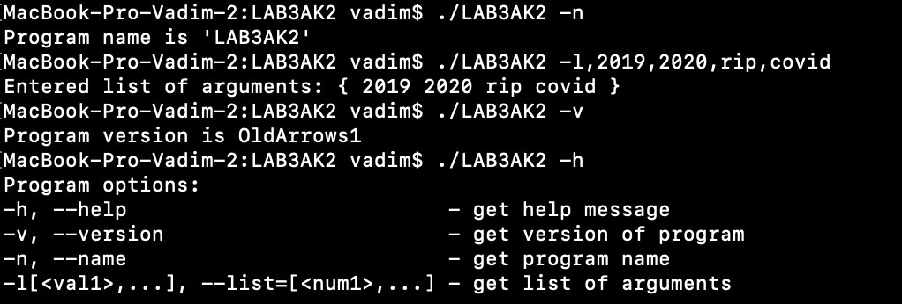

# LAB3AK2
#### Program command:

* -h, --help                            -> get help 
*  -v, --version                         -> get version
*  -n, --name                             -> get name
*  -l[arg1,...], --list=[arg1,...]       -> get list of arguments

#### Screenshot:

